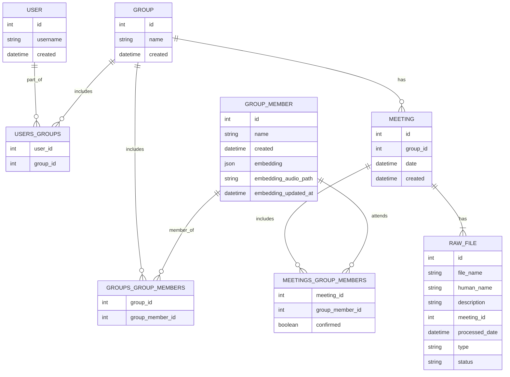

# Entity Relationship Diagram

```mermaid 
erDiagram USER ||--o{ 
    USERS_GROUPS : part_of GROUP ||--o{ 
        USERS_GROUPS : includes GROUP ||--o{ 
            GROUPS_GROUP_MEMBERS : includes GROUP_MEMBER ||--o{ 
                GROUPS_GROUP_MEMBERS : member_of MEETING ||--o{ 
                    MEETINGS_GROUP_MEMBERS : includes GROUP_MEMBER ||--o{ 
                        MEETINGS_GROUP_MEMBERS : attends GROUP ||--o{ 
                            MEETING : has MEETING ||--|{ 
                                RAW_FILE : has USER { 
                                    int id 
                                    string username 
                                    datetime created 
                                } GROUP { 
                                    int id 
                                    string name 
                                    datetime created 
                                } GROUP_MEMBER { 
                                    int id 
                                    string name 
                                    datetime created 
                                    json embedding 
                                    string embedding_audio_path 
                                    datetime embedding_updated_at 
                                } MEETING { 
                                    int id 
                                    int group_id 
                                    datetime date 
                                    datetime created 
                                } RAW_FILE { 
                                    int id 
                                    string file_name 
                                    string human_name 
                                    string description 
                                    int meeting_id 
                                    datetime processed_date 
                                    string type 
                                    string status
                                } USERS_GROUPS { 
                                    int user_id 
                                    int group_id 
                                } GROUPS_GROUP_MEMBERS { 
                                    int group_id 
                                    int group_member_id 
                                } MEETINGS_GROUP_MEMBERS { 
                                    int meeting_id 
                                    int group_member_id 
                                    boolean confirmed 
                                }
```
