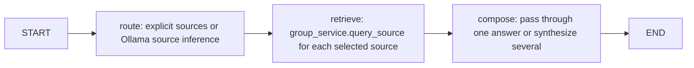
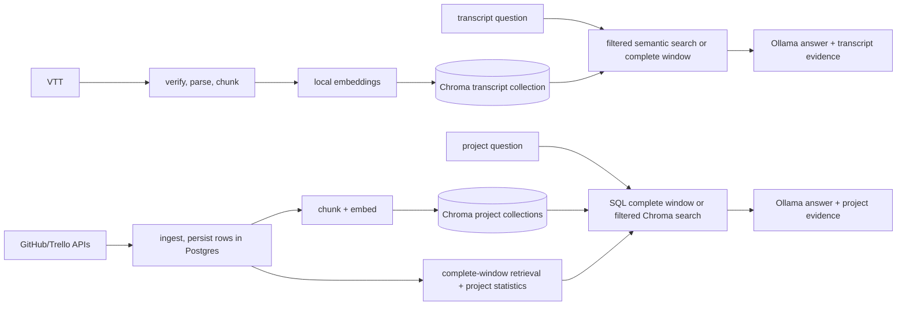

# LangChain, LangGraph, Storage, and Retrieval Map

This guide describes the current implementation. The planned three-specialist query-agent design
is in the [NLP agent roadmap](roadmap.md); it is not yet implemented. A LangGraph node is a step
in a workflow, while a LangChain tool is a typed callable an agent may invoke. Today, the Python
source has no `@tool`/`BaseTool` definitions.

## At A Glance

| Concern | Main implementation | Storage / model boundary |
| --- | --- | --- |
| LangChain integrations | [`backend/transcript_rag`](../backend/transcript_rag) and [`backend/project_rag`](../backend/project_rag) | `Document`, `Embeddings`, and Chroma vector-store adapter; no manager API tools |
| Email-agent workflows | [`app/llm`](../services/email-agent/app/llm) | LangGraph `StateGraph`; mostly deterministic API calls |
| Project RAG (GitHub/Trello) | [`query_service.py`](../backend/project_rag/services/query_service.py) | Postgres records plus Chroma embeddings |
| Meeting transcript RAG | [`indexer.py`](../backend/transcript_rag/indexer.py) | Chroma via LangChain `Chroma` and local SentenceTransformer embeddings |
| Backend LangGraph workflows | [`backend/engine`](../backend/engine) | Source routing/report orchestration; Ollama calls use the local client |

The backend's generation calls go through [`ollama_client.py`](../backend/llm/ollama_client.py), not a
LangChain chat model. LangChain is currently used for `Document`, `Embeddings`, and the Chroma
vector-store adapter. Email workflows call the client through explicit, validated application
paths. LangGraph supplies workflow state and graph execution.

## LangChain Usage

There are currently no model-callable tools. The email-agent keeps its finite command schema,
validation boundary, and explicit manager-client calls; model output cannot directly select backend
operations. The planned query specialists may receive narrowly scoped, read-only source tools after
the application binds the authenticated user and authorized group. CRUD and transcript-submission
actions remain explicit application workflows.

## LangGraph Workflows

### Main backend

[`query_graph.py`](../backend/engine/query_graph.py) is the unified group-query workflow:

The `retrieve` node calls the project/conversation query services directly, not a model-callable
tool. The per-source API endpoints can also call those services without entering this unified
graph; see [`queries.py`](../backend/routes/queries.py).

[`report_graph.py`](../backend/engine/report_graph.py) has two nodes: `collect` and `synthesise`.
`collect` reads meeting summaries/comments from Postgres, uses transcript chunks for meetings
without summaries, and asks the project RAG service for GitHub/Trello evidence. `synthesise` sends
that evidence to Ollama and returns a cited report. The graph is called by the report API and job
handlers.

### Email-agent

These current workflows call the `DiarisationClient` directly:

| Graph | Flow | Current entry point / note |
| --- | --- | --- |
| [`submit_transcript_graph.py`](../services/email-agent/app/llm/submit_transcript_graph.py) | Validate file -> resolve date -> login -> list groups -> resolve group -> create meeting -> upload VTT -> resolve/add attendees | Invoked by the submit-transcript handler. The graph does not itself send the completion email; the handler persists job state and queues the reply. |
| [`log_meeting_graph.py`](../services/email-agent/app/llm/log_meeting_graph.py) | Login -> list groups -> resolve group -> create meeting -> save notes | Invoked by the log-meeting handler. Uses direct client calls. |
| [`comment_graph.py`](../services/email-agent/app/llm/comment_graph.py) | Login -> add comment | Exposed through `CommandGraphDispatcher`; direct client calls, not the tool wrappers. |

The graph files are the source of truth for their nodes and transitions; surrounding handlers own
job persistence and email delivery.

## Storage And Retrieval

There are two RAG paths with different data and retrieval rules. Both return evidence to their
callers; retrieval is invoked by application services rather than model-selected manager tools.

### Meeting transcripts

1. Upload or transcription reaches [`indexer.py`](../backend/transcript_rag/indexer.py), which sends
   the VTT through `vtt_rag`: verification, cue parsing, speaker-turn grouping, and chunking.
   The live provided-VTT path is `routes/upload.py` -> `transcript_processing` job ->
   `backend/jobs/handlers.py`; the server-generated-VTT path calls `index_transcript` from
   `backend/processing/transcribe.py`. Both call the same indexer.
2. Chunks retain provenance such as meeting ID/title/date, speaker, time range, and chunk ID.
   `LocalEmbeddings` in [`embeddings.py`](../backend/transcript_rag/embeddings.py) adapts the
   configured local SentenceTransformer model to LangChain's `Embeddings` interface.
3. [`vectorstore.py`](../backend/transcript_rag/vectorstore.py) wraps persistent Chroma in
   LangChain's `Chroma`. Collections are named per group. Chunk IDs are upserted, obsolete chunks
   for a re-indexed meeting are removed, and `group_id` plus transcript metadata are stored with
   each document.
4. `search_transcripts` in `indexer.py` calls `search_chunks`; Chroma performs similarity search
   and applies optional meeting/date filters. Lower Chroma distance means a closer match.
5. In [`group_service.py`](../backend/project_rag/group_service.py), a bounded date-window request
   first tries to fetch every matching chunk in chronological order. If the window exceeds the
   configured limit, it falls back to semantic search. `retrieve_only=true` returns chunks and
   evidence without an Ollama answer; otherwise the selected transcript extracts are bounded by
   the prompt context limit and passed to Ollama with citation instructions.

The live application uses `process_vtt_file` through `index_transcript`.

### GitHub and Trello project data

1. [`ingest_service.py`](../backend/project_rag/services/ingest_service.py) fetches source activity
   and stores structured rows in Postgres. Commit, issue, comment, review-comment, and Trello
   action chunkers produce retrieval text plus metadata.
2. [`chunking/types.py`](../backend/project_rag/chunking/types.py) turns each chunk into a
   LangChain `Document`. `vectorstore.py` stores its text, metadata, and embedding in Chroma,
   batched for upserts. Postgres keeps the structured record; its `chroma_id` references the
   corresponding vector chunk.
3. Collections are namespaced by group/repository and content type: `commits`, `discussions`,
   and `trello`. The query layer scopes vector search by `repo_name`, applies a `since` timestamp
   filter when requested, combines results from the relevant collections, and returns a
   relevance-selected sample ordered newest-first.
4. For a small enough time window, [`query_service.py`](../backend/project_rag/services/query_service.py)
   can instead read every matching row from Postgres and rebuild equivalent chunks. Larger
   windows fall back to Chroma sampling. Project statistics are computed from Postgres separately,
   so complete counts are not inferred from a small semantic sample.
5. The service formats bounded extracts, asks Ollama to answer using the facts and evidence, then
   returns the answer, source metadata, Chroma distances, completeness/truncation information,
   and statistics through [`group_service.py`](../backend/project_rag/group_service.py).

## Suggested Reading Order

1. Read [`query_graph.py`](../backend/engine/query_graph.py) to see LangGraph routing versus
   source retrieval.
2. Follow the transcript path through [`indexer.py`](../backend/transcript_rag/indexer.py),
   [`vectorstore.py`](../backend/transcript_rag/vectorstore.py), and
   [`group_service.py`](../backend/project_rag/group_service.py). Try the conversation query's
   `retrieve_only` option to inspect returned chunks before model generation.
3. Follow project indexing through [`ingest_service.py`](../backend/project_rag/services/ingest_service.py),
   [`chunking/types.py`](../backend/project_rag/chunking/types.py),
   [`vectorstore.py`](../backend/project_rag/vectorstore.py), and
   [`query_service.py`](../backend/project_rag/services/query_service.py).
4. Compare the explicit direct-client email-agent graphs above with the backend query/report
   graphs. For the planned query-agent architecture and implementation order, see the
   [NLP agent roadmap](roadmap.md).

Useful tests include `backend/tests/test_transcript_windows.py` for transcript retrieval behavior,
and the backend query/report tests for source selection, evidence retrieval, and synthesis.