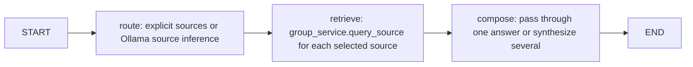
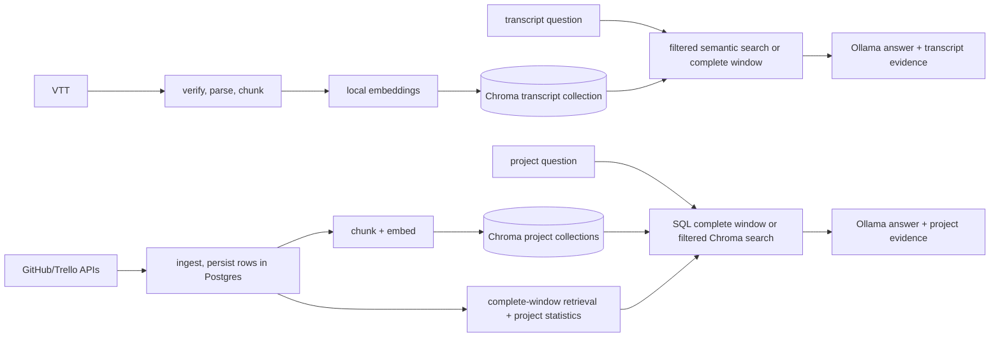

# LangChain, LangGraph, Storage, and Retrieval Map

This is a code-reading guide to the current implementation. It distinguishes LangChain tools from
LangGraph nodes: a node is a step in a workflow, while a tool is a callable adapter with a schema.
Most graphs in this repository call ordinary Python functions or the manager API directly; they do
not expose every step as a LangChain tool.

## At A Glance

| Concern | Main implementation | Storage / model boundary |
| --- | --- | --- |
| Email-agent manager tools | [`manager_tools.py`](../services/email-agent/app/llm/manager_tools.py) | Thin `@tool` wrappers around `DiarisationClient` |
| Email-agent workflows | [`app/llm`](../services/email-agent/app/llm) | LangGraph `StateGraph`; mostly deterministic API calls |
| Project RAG (GitHub/Trello) | [`query_service.py`](../backend/project_rag/services/query_service.py) | Postgres records plus Chroma embeddings |
| Meeting transcript RAG | [`indexer.py`](../backend/transcript_rag/indexer.py) | Chroma via LangChain `Chroma` and local SentenceTransformer embeddings |
| Backend LangGraph workflows | [`backend/engine`](../backend/engine) | Source routing/report orchestration; Ollama calls use the local client |

The backend's generation calls go through [`ollama_client.py`](../backend/llm/ollama_client.py), not a
LangChain chat model. LangChain is used for `BaseTool`/`@tool`, `Document`, `Embeddings`, and the
Chroma vector-store adapter. LangGraph supplies workflow state and graph execution.

## LangChain Tool Inventory

All eight `@tool` definitions currently found in the repository are created by
`build_manager_tools(client)` in [`manager_tools.py`](../services/email-agent/app/llm/manager_tools.py).
They are wrappers around existing client methods, not independent business logic.

| Tool | Inputs | What it calls / returns |
| --- | --- | --- |
| `list_groups` | `token` | Lists groups available to the user. |
| `get_group` | `token`, `group_id` | Returns group details and members. |
| `list_meetings` | `token`, `group_id`, optional `from_date`, `to_date` | Lists meetings, optionally within a date range. |
| `get_meeting` | `token`, `group_id`, `meeting_id` | Fetches one meeting. |
| `add_comment` | `token`, `group_id`, `meeting_id`, `comment` | Adds a comment to a meeting. This mutates backend state. |
| `resolve_aliases` | `token`, `group_id`, `names`, optional `source` | Resolves transcript speaker labels to member IDs. |
| `search_transcripts` | `token`, `group_id`, `query`, optional `meeting_id` | Requests semantically relevant indexed transcript chunks. |
| `login_for_email` | `email` | Exchanges a verified email for a user JWT through the client. |

`_serialise` converts dataclasses and nested collections to JSON-like Python values for tool results.
The `token` argument is a user credential and should be treated as transient sensitive state.

### Where Those Tools Run

[`manager_graph.py`](../services/email-agent/app/llm/manager_graph.py) builds a name-to-tool map,
then runs one `execute_manager_tool` node. The caller supplies `tool_name` and `arguments`; the
node calls `tool.invoke(payload)` and records start/result audit events. This is **not** an LLM
agent loop: there is no model choosing tools, and there are no conditional tool-call rounds.

The current call-site search finds `build_manager_graph` in its unit test, but not in an
email-agent handler. The tool layer is therefore implemented and tested, but the manager graph is
not currently wired into the normal handler path.

## LangGraph Workflows

### Main backend

[`query_graph.py`](../backend/engine/query_graph.py) is the unified group-query workflow:

The `retrieve` node calls the project/conversation query services directly. It does not call the
email-agent `search_transcripts` tool. The per-source API endpoints can also call those services
without entering this unified graph; see [`queries.py`](../backend/routes/queries.py).

[`report_graph.py`](../backend/engine/report_graph.py) has two nodes: `collect` and `synthesise`.
`collect` reads meeting summaries/comments from Postgres, uses transcript chunks for meetings
without summaries, and asks the project RAG service for GitHub/Trello evidence. `synthesise` sends
that evidence to Ollama and returns a cited report. The graph is called by the report API and job
handlers.

### Email-agent

These graphs are separate from the `@tool` inventory above:

| Graph | Flow | Current entry point / note |
| --- | --- | --- |
| [`submit_transcript_graph.py`](../services/email-agent/app/llm/submit_transcript_graph.py) | Validate file -> resolve date -> login -> list groups -> resolve group -> create meeting -> upload VTT -> resolve/add attendees | Invoked by the submit-transcript handler. Calls `DiarisationClient` directly; it does not invoke the `BaseTool` wrappers. |
| [`log_meeting_graph.py`](../services/email-agent/app/llm/log_meeting_graph.py) | Login -> list groups -> resolve group -> create meeting -> save notes | Invoked by the log-meeting handler. Uses direct client calls. |
| [`comment_graph.py`](../services/email-agent/app/llm/comment_graph.py) | Login -> add comment | Exposed through `CommandGraphDispatcher`; direct client calls, not the tool wrappers. |
| [`manager_graph.py`](../services/email-agent/app/llm/manager_graph.py) | Execute one explicitly selected manager tool | Tool execution wrapper; currently no production handler call site found. |

The submit-transcript design note describes intended boundaries, but the implementation file is
the source of truth for exactly which nodes and calls currently run.

## Storage And Retrieval

There are two RAG paths with different data and retrieval rules. Both return evidence to the API,
but only the transcript path is exposed as the `search_transcripts` manager tool.

### Meeting transcripts

1. Upload or transcription reaches [`indexer.py`](../backend/transcript_rag/indexer.py), which sends
   the VTT through `vtt_rag`: verification, cue parsing, speaker-turn grouping, and chunking.
2. Chunks retain provenance such as meeting ID/title/date, speaker, time range, and chunk ID.
   `LocalEmbeddings` in [`embeddings.py`](../backend/transcript_rag/embeddings.py) adapts the
   configured local SentenceTransformer model to LangChain's `Embeddings` interface.
3. [`vectorstore.py`](../backend/transcript_rag/vectorstore.py) wraps persistent Chroma in
   LangChain's `Chroma`. Collections are named per group. Chunk IDs are upserted, obsolete chunks
   for a re-indexed meeting are removed, and `group_id` plus transcript metadata are stored with
   each document.
4. `search_transcripts` in `indexer.py` calls `search_chunks`; Chroma performs similarity search
   and applies optional meeting/date filters. Lower Chroma distance means a closer match.
5. In [`group_service.py`](../backend/project_rag/group_service.py), a bounded date-window request
   first tries to fetch every matching chunk in chronological order. If the window exceeds the
   configured limit, it falls back to semantic search. `retrieve_only=true` returns chunks and
   evidence without an Ollama answer; otherwise the selected transcript extracts are bounded by
   the prompt context limit and passed to Ollama with citation instructions.

### GitHub and Trello project data

1. [`ingest_service.py`](../backend/project_rag/services/ingest_service.py) fetches source activity
   and stores structured rows in Postgres. Commit, issue, comment, review-comment, and Trello
   action chunkers produce retrieval text plus metadata.
2. [`chunking/types.py`](../backend/project_rag/chunking/types.py) turns each chunk into a
   LangChain `Document`. `vectorstore.py` stores its text, metadata, and embedding in Chroma,
   batched for upserts. Postgres keeps the structured record; its `chroma_id` references the
   corresponding vector chunk.
3. Collections are namespaced by group/repository and content type: `commits`, `discussions`,
   and `trello`. The query layer scopes vector search by `repo_name`, applies a `since` timestamp
   filter when requested, combines results from the relevant collections, and returns a
   relevance-selected sample ordered newest-first.
4. For a small enough time window, [`query_service.py`](../backend/project_rag/services/query_service.py)
   can instead read every matching row from Postgres and rebuild equivalent chunks. Larger
   windows fall back to Chroma sampling. Project statistics are computed from Postgres separately,
   so complete counts are not inferred from a small semantic sample.
5. The service formats bounded extracts, asks Ollama to answer using the facts and evidence, then
   returns the answer, source metadata, Chroma distances, completeness/truncation information,
   and statistics through [`group_service.py`](../backend/project_rag/group_service.py).

## Suggested Reading Order

1. Read [`query_graph.py`](../backend/engine/query_graph.py) to see LangGraph routing versus
   source retrieval.
2. Follow the transcript path through [`indexer.py`](../backend/transcript_rag/indexer.py),
   [`vectorstore.py`](../backend/transcript_rag/vectorstore.py), and
   [`group_service.py`](../backend/project_rag/group_service.py). Try the conversation query's
   `retrieve_only` option to inspect returned chunks before model generation.
3. Follow project indexing through [`ingest_service.py`](../backend/project_rag/services/ingest_service.py),
   [`chunking/types.py`](../backend/project_rag/chunking/types.py),
   [`vectorstore.py`](../backend/project_rag/vectorstore.py), and
   [`query_service.py`](../backend/project_rag/services/query_service.py).
4. Compare the manager tool wrappers in `manager_tools.py` with their single-node caller in
   `manager_graph.py`; then compare those with the direct-client email-agent graphs above.

Useful tests include `backend/tests/test_transcript_windows.py` for transcript retrieval behavior,
and `services/email-agent/tests/test_langchain_tools.py` plus
`services/email-agent/tests/test_manager_graph.py` for tool construction and graph invocation.