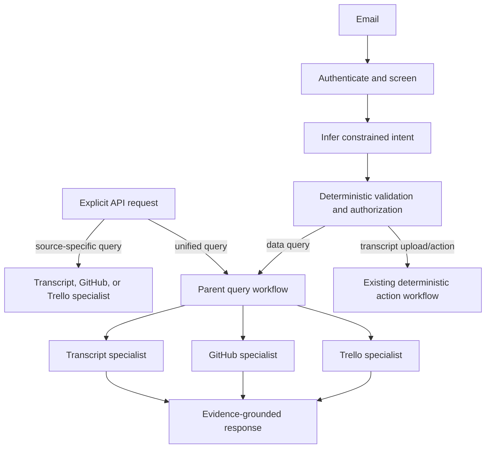

# NLP Agent Architecture Roadmap

This is the single implementation roadmap for natural-language query agents. It distinguishes
the current system from the target design; the target is not yet implemented. CRUD and existing
transcript-submission actions remain explicit API/application workflows, not query-agent tools.

## Agreed Design

- API routes already identify the requested operation. CRUD endpoints continue to call their
  explicit handlers; query endpoints select the source-specific query component without
  re-inferring the request.
- Email requires intent interpretation after sender authentication and message screening. A
  constrained parser distinguishes supported actions (including transcript submission) from
  data queries. Deterministic validation remains the gate before execution.
- There will be three specialist query agents: **transcripts/conversation**, **GitHub**, and
  **Trello**. Each is read-only and returns an answer with inspectable evidence and source
  metadata.
- API source-specific query routes invoke the matching specialist. The unified API route and
  email-query path use a **parent query agent** to select and orchestrate relevant specialists,
  combine their evidence, and handle partial source failures.
- The email parent runs only after the authenticated sender, authorized group, and validated
  intent are bound by application code. Agents never choose credentials, arbitrary URLs, group
  permissions, or CRUD operations. Data access stays scoped and authorized in the backend.
- LangChain provides specialist query/tool and model composition where useful. LangGraph
  coordinates multi-step parent workflows, routing, evidence aggregation, and resumable follow-up
  state. Simple deterministic actions need not be wrapped in agents.

## Current Baseline

- `backend/routes/queries.py` exposes conversation, GitHub, Trello, and unified query routes.
- `backend/engine/query_graph.py` routes a unified query, retrieves per-source answers, and
  composes them. `backend/project_rag` and `backend/transcript_rag` implement retrieval and
  evidence; Ollama generation currently goes through `backend/llm/ollama_client.py`.
- The email agent parses a constrained command and validates it. `assess_query` calls the
  backend query API using its `DiarisationClient`; it does not yet use a parent LangChain agent.
- Transcript upload and transcription already have deterministic processing paths. Provided and
  generated VTTs are chunked and indexed into persistent Chroma; see the
  [retrieval implementation guide](langchain-langgraph-storage-retrieval.md).
- Weekly reports already use a backend LangGraph and persist report evidence. Their flow is
  separate from conversational query-agent state.
- No model-selectable `@tool`/`BaseTool` definitions currently exist in the Python source.

## Implementation Phases

### 1. Define contracts and evaluation baseline

- Specify common specialist input/output schemas: authorized group context, question, source
  filters, answer, quantitative facts, evidence IDs/metadata, errors, and model/retrieval metadata.
  Quantitative facts must retain their scope, units, provenance, and completeness so the parent can
  combine them with qualitative evidence without estimating counts from retrieved chunks.
- Keep identity, authorization, and group scope outside model-controlled arguments. Define a
  read-only allowlist for each specialist; do not register create/update/delete operations.
- Build a representative evaluation set covering single-source, cross-source, ambiguous,
  unsupported, empty-evidence, unavailable-source, and mixed qualitative/quantitative questions.
  Include transcript speaker-duration/word/turn questions and project activity counts. Capture
  current answers and evidence as a baseline.
- Pin/record model, embedding, framework, prompt, chunking, and retrieval configuration needed
  to reproduce results.

**Exit gate:** contracts, threat model, and baseline cases are reviewed before agent behavior is
introduced.

### 2. Implement the three specialist query agents

- Implement transcript, GitHub, and Trello specialists behind shared typed contracts.
- Define each specialist's LangChain tools here: narrow, typed, read-only wrappers around its
  existing retrieval/query service. These tools give the specialist agent the ability to inspect
  its source; they are not CRUD endpoints and are not exposed directly to email users.
- Make transcript speaker statistics available to the conversation specialist as structured,
  deterministic data alongside transcript RAG evidence. Support authorized group/meeting/date
  scope for speaker duration, share of meeting time, word count, and turn count. The existing
  `stats.json` is generated but currently has no query/API reader; add a durable/readable path and
  a read-only statistics tool rather than asking the model to count retrieved chunks.
- Reuse current backend retrieval: transcript Chroma and bounded complete-window reads; project
  Chroma plus Postgres facts/complete-window reads. Preserve GitHub/Trello aggregates from SQL as
  structured specialist output as well as prompt context.
- Bind the authenticated principal and authorized group in application context, not tool arguments
  generated by the model. Give each specialist only its own source's capabilities. Return
  citations/evidence rather than hiding retrieved context inside generated prose.
- Keep existing API response shapes stable while routing each source endpoint through its
  specialist.

**Exit gate:** per-source API tests preserve authorization, evidence contracts, and baseline
retrieval/answer quality; no write operation is reachable from a specialist.

### 3. Add the parent query agent

- Replace or evolve the unified query graph into a parent LangGraph workflow that selects the
  relevant specialists, invokes them, handles partial failures, and composes a source-attributed
  answer from their evidence.
- Add only three delegation capabilities to the parent (transcripts, GitHub, Trello), implemented
  as specialist-agent invocations or graph subgraphs. The parent does not receive CRUD tools or
  lower-level unrestricted API access.
- Make the unified API query route invoke this parent workflow directly; API intent remains
  explicit in the route/request, not inferred from arbitrary API calls.
- Record selected sources, specialist inputs/outputs, evidence, failures, and final composition
  for audit and evaluation.

**Exit gate:** cross-source answers preserve source attribution, surface unavailable sources, and
pass the evaluation set against the current unified-query baseline.

### 4. Route validated email queries through the parent

- Preserve the email trust boundary: authenticate sender and screen message, parse into the finite
  intent schema, then run deterministic validation and bind the authorized group before agent
  execution.
- Align the command-parser prompt and its tests with current behavior: the prompt still describes
  `assess_query` as dry-run-only although the handler performs live backend queries. The parser
  should select query intent/sources, not imply it has queried data or generated the answer.
- Route validated transcript-upload/action intents to their existing deterministic workflows.
  Route only validated data-query intents to the parent query agent.
- Remove duplicate source orchestration from the email `assess_query` handler after parity is
  established; keep it as the API client, job, and email-delivery boundary.
- Test spoofing/prompt injection, unauthorized and ambiguous groups, unsupported requests,
  source failures, cancellation, and equivalent API-versus-email query behavior.

**Exit gate:** no agent runs before authentication/validation, and email cannot expand the
permitted operation set or source scope.

### 5. Persist follow-up conversation state

- Add durable conversation/turn records linked to authenticated sender, authorized group, and
  email message/thread IDs. Keep this application-owned store authoritative; LangGraph
  checkpoints may support execution recovery but are not the only record.
- Persist each user query, selected specialists, evidence references/snapshots, answer, and
  relevant model/prompt versions. Apply retention and privacy rules to message content.
- Let follow-ups reuse prior context only within the same authorized conversation, and re-query
  data when the follow-up asks for new or current evidence. Never use old thread context as proof
  of current authorization.
- Add API conversation identifiers for clients that need multi-turn queries; keep one-shot source
  endpoints usable without conversation state.

**Exit gate:** tests cover email threading, API continuation, restart/recovery, ownership
isolation, evidence traceability, and stale-data behavior.

### 6. Evaluate, roll out, and document

- Compare against the baseline for source selection, retrieval relevance, factual support,
  citation correctness, partial-failure handling, latency, and resource use.
- Run the new workflow in shadow or opt-in mode, inspect failures, then enable it incrementally.
- Retire old query orchestration only after parity and evaluation criteria pass. Keep action/CRUD
  handlers unchanged unless a separately reviewed requirement calls for a change.
- Publish architecture decisions, evaluation protocol/results, dependency/model versions, and
  known limitations for the academic paper and software release.

**Exit gate:** reproducible evaluation, documented residual risks, and an explicit cutover decision.

## Non-Goals

- Replacing SQL, CRUD handlers, authentication, or authorization with an agent.
- Giving an LLM unrestricted API, filesystem, shell, or network access.
- Requiring every deterministic workflow or single-step query to use LangGraph.
- Treating framework adoption alone as evidence of retrieval or answer quality.
