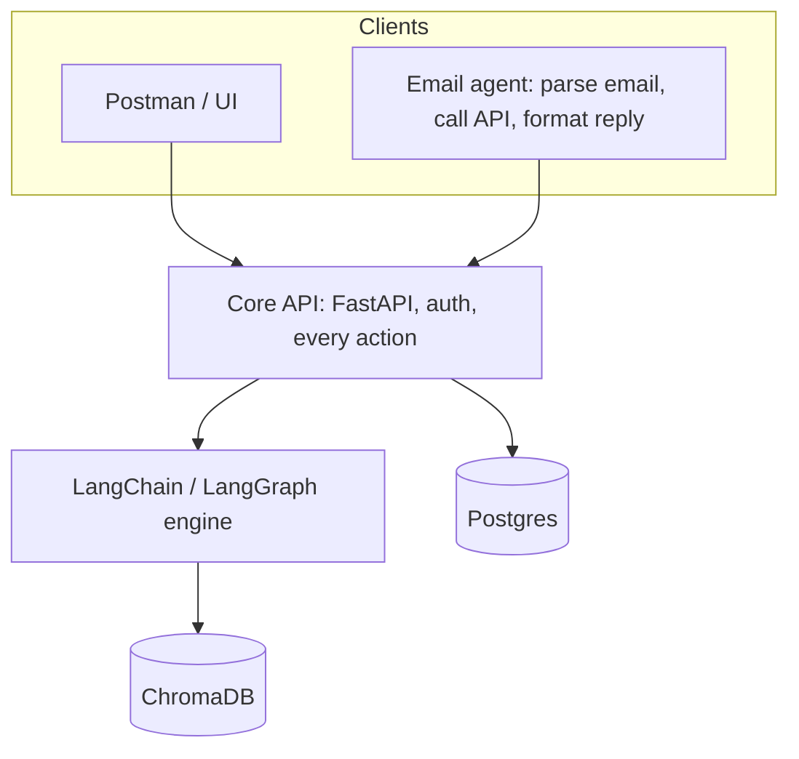

# Architecture Roadmap

## Target stack



Principles:

- The API is the only interface. Anything the email agent can do, a Postman user can do with the same auth model.
- The email agent is a thin client: intent parsing, API call, reply formatting. No retrieval or business logic.
- The backend owns all retrieval and composition, with LangChain/LangGraph as the single engine.
- Postgres holds all user-visible state. ChromaDB holds all vector data.

## Query API design

Each source is a separate, individually callable endpoint, plus a unified endpoint that routes across them.

| Endpoint | Purpose |
|---|---|
| `POST /groups/{group_id}/conversation/query` | Query meeting transcripts (replaces `POST /transcripts/search`) |
| `POST /groups/{group_id}/github/query` | Query the group's linked GitHub repo |
| `POST /groups/{group_id}/trello/query` | Query the group's linked Trello board |
| `POST /groups/{group_id}/query` | Unified: infer sources, query them, compose one answer |

Request (all endpoints):

```json
{ "question": "string", "period_start": "date?", "period_end": "date?", "top_k": 5 }
```

The unified endpoint also accepts `"sources": ["conversation", "github", "trello"]`. If omitted, the router infers them.

Response (per-source endpoints): `answer`, `evidence[]` (snippet, source id, link/timestamp, score).

Response (unified): `answer`, `sources_used[]`, `evidence` keyed by source, and per-source errors that do not fail the whole request.

Design notes:

- Per-source endpoints return retrieval-grounded answers with evidence. A `mode=retrieve` option may return evidence only, with no LLM call.
- The unified endpoint is a LangGraph workflow: route (choose sources) -> parallel retrieve -> compose -> answer. Source failures degrade gracefully and are reported in the response.
- Deprecate `POST /transcripts/search`, keeping a redirect or alias for one release.

## Phases

### Phase 1: Rename and expose per-source query endpoints (done in backend; agent not yet switched)

GitHub-RAGinator was ported into `backend/project_rag/` (migrated, not proxied). Endpoints live in `backend/routes/queries.py`; `/transcripts/search` is deprecated. The email agent still calls RAGinator directly until Phase 2.

- Add `conversation/query` over the existing transcript vector store, and deprecate `/transcripts/search`.
- Add `github/query` and `trello/query` in the backend. Choose one:
  - Proxy GitHub-RAGinator behind the backend, using group `github_repo_url` and `trello_board_id`.
  - Move GitHub/Trello indexing into the backend and ChromaDB (preferred long-term, removes the unauthenticated service).
- Regenerate `docs/openapi.json` and the agent's generated client.

### Phase 2: Unified query

- Implement `POST /groups/{group_id}/query` as a LangGraph router + composer in the backend.
- Move the agent's assess logic (`handlers/assess_query.py`) and source collection (`reports/sources.py`) into this engine.
- Reduce the agent's assess handler to a single call to the unified endpoint.

### Phase 3: Consolidate the engine

- Make LangChain/LangGraph the single orchestration layer in the backend.
- Remove duplicated report generation: keep one implementation in the backend (`routes/reports.py`), and have the agent's `reports/` call it.
- Keep the agent's LangGraph usage to intent parsing and tool selection only.

### Phase 4: Command parity

- Build a table: every agent command -> exactly one API route. Fill gaps in either direction (comments, attendees, etc.).
- Add tests that exercise each action via the generated client and via direct HTTP.
- Confirm the agent acts as the emailing user (per-user token), not a privileged identity.

### Phase 5: Jobs and state

- Add an async job API (create, status, result) for transcription, reports, and long queries.
- Move user-visible job state from the agent's store into Postgres. The agent keeps only email-thread state.

## Open decisions

- Proxy vs. migrate GitHub-RAGinator into the backend (Phase 1).
- Whether per-source endpoints return LLM answers by default or evidence only.
- Authorisation model for group-scoped queries (member vs. owner vs. admin).
