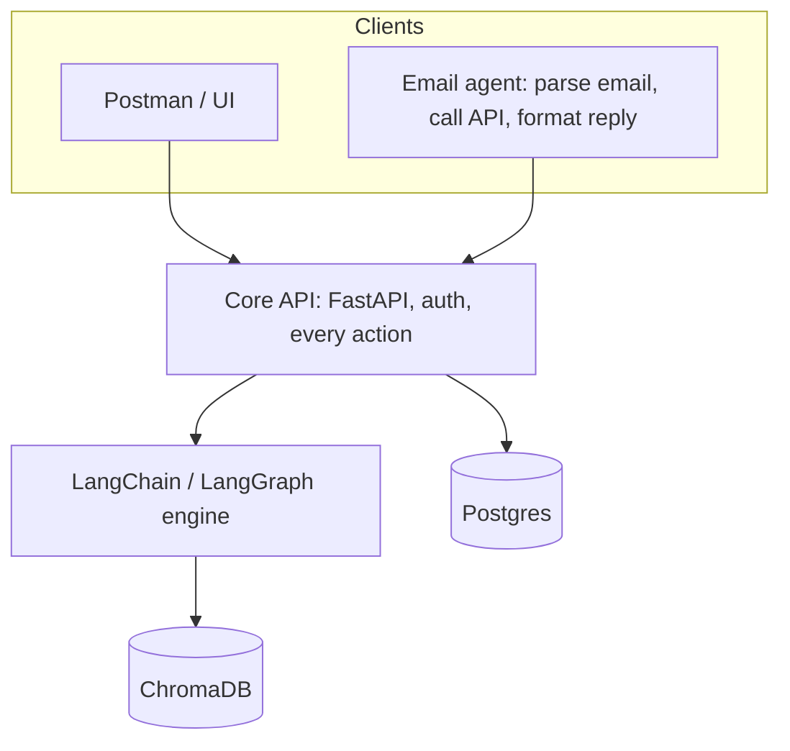

# Architecture Roadmap

## Target stack



Principles:

- The API is the only interface. Anything the email agent can do, a Postman user can do with the same auth model.
- The email agent is a thin client: intent parsing, API call, reply formatting. No retrieval or business logic.
- The backend owns all retrieval and composition, with LangChain/LangGraph as the single engine.
- Postgres holds all user-visible state. ChromaDB holds all vector data.

## Query API design

Each source is a separate, individually callable endpoint, plus a unified endpoint that routes across them.

| Endpoint | Purpose |
|---|---|
| `POST /groups/{group_id}/conversation/query` | Query meeting transcripts (replaces `POST /transcripts/search`) |
| `POST /groups/{group_id}/github/query` | Query the group's linked GitHub repo |
| `POST /groups/{group_id}/trello/query` | Query the group's linked Trello board |
| `POST /groups/{group_id}/query` | Unified: infer sources, query them, compose one answer |

Request (all endpoints):

```json
{ "question": "string", "period_start": "date?", "period_end": "date?", "top_k": 5 }
```

The unified endpoint also accepts `"sources": ["conversation", "github", "trello"]`. If omitted, the router infers them.

Response (per-source endpoints): `answer`, `evidence[]` (snippet, source id, link/timestamp, score).

Response (unified): `answer`, `sources_used[]`, `evidence` keyed by source, and per-source errors that do not fail the whole request.

Design notes:

- Per-source endpoints return retrieval-grounded answers with evidence. A `mode=retrieve` option may return evidence only, with no LLM call.
- The unified endpoint is a LangGraph workflow: route (choose sources) -> parallel retrieve -> compose -> answer. Source failures degrade gracefully and are reported in the response.
- Deprecate `POST /transcripts/search`, keeping a redirect or alias for one release.

## Phases

### Phase 1: Rename and expose per-source query endpoints (done)

GitHub-RAGinator was ported into `backend/project_rag/` (migrated, not proxied). Endpoints live in `backend/routes/queries.py`; `/transcripts/search` is deprecated. The agent now uses these endpoints (Phase 2). Transcript queries accept `since`/`until` (range filtered in Chroma via numeric `meeting_ts`, small windows read in full) and `retrieve_only`; run `python -m scripts.backfill_transcript_dates` once to add `meeting_ts` to existing chunks.

- Add `conversation/query` over the existing transcript vector store, and deprecate `/transcripts/search`.
- Add `github/query` and `trello/query` in the backend. Choose one:
  - Proxy GitHub-RAGinator behind the backend, using group `github_repo_url` and `trello_board_id`.
  - Move GitHub/Trello indexing into the backend and ChromaDB (preferred long-term, removes the unauthenticated service).
- Regenerate `docs/openapi.json` and the agent's generated client.

### Phase 2: Unified query (done)

- Implement `POST /groups/{group_id}/query` as a LangGraph router + composer in the backend.
- Move the agent's assess logic (`handlers/assess_query.py`) and source collection (`reports/sources.py`) into this engine.
- Reduce the agent's assess handler to a single call to the unified endpoint.

### Phase 3: Consolidate the engine (mostly done)

Done: the unified query (`backend/engine/query_graph.py`) and weekly report (`backend/engine/report_graph.py`) are LangGraph graphs in the backend. `POST /groups/{id}/reports/weekly` composes a cited report (meeting summaries and comments, transcript chunks for unsummarised meetings, GitHub and Trello activity) and `POST /groups/{id}/reports/answer` answers follow-ups from saved evidence; both are stateless. The old `/reports/generate_report` is removed. The agent keeps only delivery state (SQLite report store, outbox, email threading) and the scheduler now runs the weekly update. Remaining: the agent's LangGraph workflows for submit/comment/log-meeting still orchestrate multi-step API calls agent-side; they move with the Phase 4 parity work and Phase 5 jobs API.

- Make LangChain/LangGraph the single orchestration layer in the backend.
- Remove duplicated report generation: keep one implementation in the backend (`routes/reports.py`), and have the agent's `reports/` call it.
- Keep the agent's LangGraph usage to intent parsing and tool selection only.

### Phase 4: Command parity (mostly done)

Every email command goes through routes a Postman user can call, with the emailing user's own token. Guarded by `services/email-agent/tests/test_api_parity.py` (commands map to routes in `docs/openapi.json`) and `backend/tests/test_agent_client_parity.py` (the agent's real client runs each action against a live backend).

| Email command | API routes |
|---|---|
| `submit_transcript` | `POST /admin/user-token` (service key, mints the sender's own token), `GET /groups/`, `POST /groups/{id}/meetings/`, `POST .../upload/`, `POST /groups/{id}/aliases/resolve`, `POST .../attendees` |
| `assess_query` | `POST /groups/{id}/conversation/query`, `/github/query`, `/trello/query`, `/query` |
| `add_comment` | `POST /groups/{id}/meetings/{mid}/comments` |
| `log_meeting` | `POST /groups/{id}/meetings/` + `.../comments` |
| weekly update and replies | `POST /groups/{id}/reports/weekly`, `/reports/answer` |
| `status`, `results`, `cancel` | none: job tracking is agent-only until the Phase 5 jobs API |
| `help` | local |

API-only today (no email command): group, member and user administration, meeting delete, attendee removal, audio transcription, meeting summaries, GitHub/Trello ingest and stats. Candidates to expose by email if wanted: meeting summary, ingest, stats.

Identity: the agent mints a token for the verified sender and uses it for everything except `/admin/*` reads. Tokens minted for email carry `channel=email`, and the backend ignores administrator rights on them: admin-only routes, the `all_groups` listing, assigning another owner, and the admin override on group access all return 403 "Administrator actions are not available over email". An admin emailing the agent has only their ordinary group roles, and the agent replies with an explanation instead of the raw error. The same admin keeps every right through the API. Tests confirm the email token cannot call service routes, that a group-member token can comment but not query, and the admin restriction.

Future: new email abilities should not mean new hard-coded commands. The agent already wraps its API client as LangChain tools (`app/llm/manager_tools.py`). The intended flow is: email arrives, sender is authenticated, a per-user `channel=email` token is minted, and the model selects tools from the API-backed set to carry out the request. Every tool call runs with that token, so the backend's authorisation applies exactly as it does for a Postman user.

### Phase 5: Jobs and state

- Add an async job API (create, status, result) for transcription, reports, and long queries.
- Move user-visible job state from the agent's store into Postgres. The agent keeps only email-thread state.

## Open decisions

- Proxy vs. migrate GitHub-RAGinator into the backend (Phase 1).
- Whether per-source endpoints return LLM answers by default or evidence only.
- Authorisation model for group-scoped queries (member vs. owner vs. admin).
