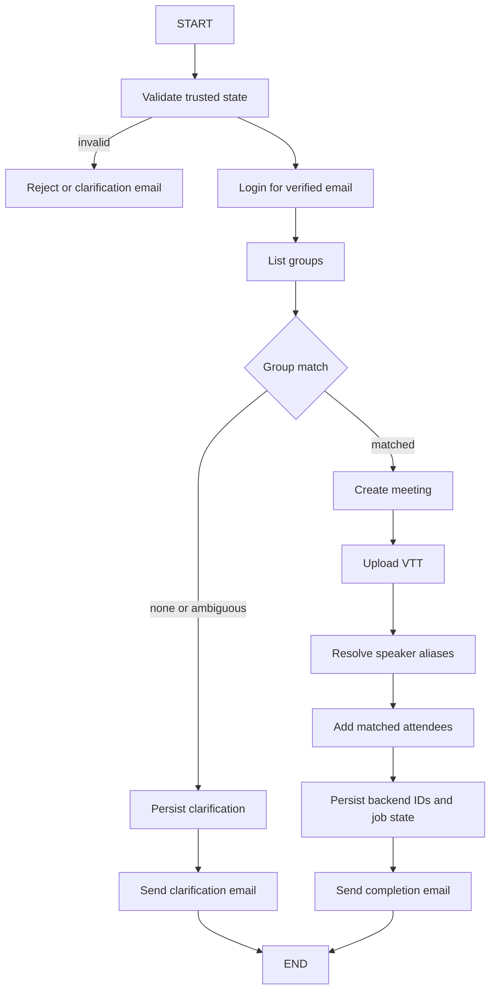

# Submit Transcript Graph Design

## Purpose

This document maps the proposed LangGraph workflow for `submit_transcript` before runtime cutover.
The existing deterministic pipeline remains the reference implementation until this graph passes the
same fixture and integration corpus.

The manager API owns the downstream processing. The email agent should orchestrate only the bounded
steps needed to validate the attachment, identify the group, create a meeting, upload the VTT, and
record the result.

## Security boundary

The graph does not authenticate arbitrary users or choose unrestricted API paths.

Before graph execution:

1. The mail provider supplies the sender address and SPF/DKIM/DMARC signals.
2. `SenderAuthoriser` verifies the sender before the LLM is called.
3. The command parser produces a constrained `ParsedCommand`.
4. `validate_command` resolves the actual attachment from the provider's attachment list.
5. The sender's email is the only identity used for the backend token exchange.

Inside the graph:

- `group_id`, meeting date, attachment path, and sender identity come from trusted validated state.
- The graph calls explicit manager tools only.
- The manager API remains authoritative for user/group authorization.
- No graph node accepts an arbitrary URL, HTTP method, or backend user ID from the LLM.

## State

The graph state should be explicit and serializable:

```python
class SubmitTranscriptState(TypedDict, total=False):
    job_id: str
    sender_email: str
    source_message_id: str
    in_reply_to: str | None
    references: str | None

    attachment_filename: str
    attachment_path: str
    attachment_content: bytes
    attachment_size_bytes: int

    group_hint: str | None
    group_id: int | None
    group_name: str | None
    meeting_date: str
    meeting_date_source: str

    token: str
    meeting_id: int | None
    uploaded_file_id: int | None
    speakers: list[str]
    resolved_attendees: list[str]
    unresolved_speakers: list[str]

    clarification_question: str | None
    result: str | None
    error: str | None
    audit_events: list[dict]
```

Do not place secrets such as the service API key in graph state. The typed manager client owns
that configuration. A short-lived user JWT may be present in transient state only if required by
the tool adapter; it must never be included in email text or ordinary logs.

## Graph flow



## Nodes

### 1. `validate_trusted_state`

Inputs:

- validated command
- job record
- stored attachment path
- sender email

Checks:

- the job exists and belongs to the sender
- the attachment path is inside the configured storage area
- the file still exists
- the file extension is `.vtt`
- the stored size is within the configured limit
- meeting date is present and parseable

This node should fail closed. It should not call the backend.

### 2. `login_for_email`

Call the explicit manager client operation using the already authorised sender email.

```text
login_for_email(sender_email) -> user JWT
```

Transient failures should follow the existing retry policy. Authentication and user-not-found
failures should become a failed job and an admin alert, following the current handler behavior.

### 3. `list_groups`

Call:

```text
list_groups(token) -> groups visible to the authenticated user
```

The graph should not invent a group. It passes the returned groups plus the trusted `group_hint`
to a deterministic matching function equivalent to the current `match_group` implementation.

Outcomes:

- exactly one match: continue
- no match: persist clarification options and stop
- multiple matches: persist clarification options and stop

### 4. `resolve_group`

This node is deterministic and should not use an LLM. It records:

- `group_id`
- `group_name`
- matching basis

The graph must not proceed without exactly one group.

### 5. `create_meeting`

Call:

```text
create_meeting(token, group_id, meeting_date) -> meeting
```

Persist the backend meeting ID immediately after success. This supports recovery and makes the
external side effect visible in the job audit trail.

The operation is not naturally idempotent. Before retrying after an ambiguous transport failure,
the implementation now uses:

- `Idempotency-Key: <email-agent job ID>` on meeting creation
- a persisted unique `meetings.idempotency_key` column in the manager database
- reuse of the existing meeting when the same key is submitted again
- a `409` response if a key is attempted against another group

Blindly retrying meeting creation can create duplicate meetings.

### 6. `upload_transcript`

Call:

```text
upload_file(token, group_id, meeting_id, filename, content) -> uploaded file
```

Persist the returned raw-file ID. The manager API then owns downstream indexing, processing, and
its own response/notification behavior.

The file content should be read from the controlled attachment path, not from an LLM-produced value.

### 7. `resolve_aliases`

Call:

```text
resolve_aliases(token, group_id, speakers, source="transcript_name")
```

The VTT parser remains deterministic and supplies the speaker labels. The graph does not ask an
LLM to infer speaker names.

### 8. `add_attendees`

For every resolved member ID, call:

```text
add_attendee(token, group_id, meeting_id, member_id)
```

Record resolved and unresolved speaker names. A missing alias should not fail the entire meeting
submission; this matches the current behavior.

### 9. `complete_job`

Persist:

- resolved group
- backend meeting ID
- uploaded file ID
- resolved attendees
- unresolved speakers
- completed status

Move the attachment to the completed storage directory after the required metadata is persisted.

### 10. `enqueue_completion`

Use the existing completion template and outbox. The graph should enqueue the same subject, body,
thread headers, and job ID as the deterministic handler.

## Clarification path

When group resolution is ambiguous:

1. Set the job to `NEEDS_CLARIFICATION`.
2. Persist the question and group options in `PendingClarificationStore`.
3. Enqueue the clarification email.
4. Do not create a meeting.
5. Do not upload the transcript.
6. Leave the job available for the existing clarification-reply flow.

This is a hard side-effect boundary: no backend write may happen before group resolution succeeds.

## Failure paths

### Invalid VTT

Handled before backend calls. Mark the job failed, move the attachment to failed storage, and send
the existing invalid-transcript reply.

### Backend unavailable before meeting creation

Mark the job failed, move the attachment to failed storage, enqueue the existing backend failure
reply, and send the rate-limited admin alert.

### Meeting created but upload fails

This is a partial external side effect. Persist the meeting ID and mark the job failed. Do not
silently create another meeting on an automatic retry. The recovery policy must either:

- look up and reuse the existing meeting, or
- require an explicit operator retry.

### Alias resolution partially fails

Preserve the meeting and uploaded file. Record unresolved speakers and continue where safe. This
matches the current non-fatal unresolved-speaker behavior.

## Audit events

Each node should append an event with:

```json
{
  "event": "create_meeting_start",
  "job_id": "DIAR-...",
  "timestamp": "...",
  "metadata": {}
}
```

Minimum event names:

- `validate_start`
- `login_start`
- `login_result`
- `groups_listed`
- `group_matched`
- `clarification_required`
- `create_meeting_start`
- `create_meeting_result`
- `upload_start`
- `upload_result`
- `aliases_resolved`
- `attendee_added`
- `job_completed`
- `job_failed`

Do not put transcript text, credentials, or full email bodies into ordinary audit logs.

## Checkpointing

The first implementation can use the existing SQLite job record as the durable checkpoint boundary.
Each successful side effect must be persisted before the next side effect begins.

A later LangGraph checkpointer can store resumable node state, but it must not become the only copy
of critical job state. The job store remains the source of truth for email status, ownership, and
recovery.

## Parity requirements

Before enabling this graph path for production email:

1. Run both implementations against identical valid VTT fixtures.
2. Compare job state transitions.
3. Compare group clarification behavior.
4. Compare backend call order and arguments.
5. Compare attachment moves.
6. Compare outbox subjects, bodies, job IDs, and threading headers.
7. Test malformed VTT, ambiguous group, missing group, backend timeout, upload failure, and partial
   alias resolution.
8. Test duplicate delivery and crash recovery.

The deterministic implementation should remain available behind a feature flag until these parity
checks pass.

## Recommended next implementation step

The first slice is implemented in `app/llm/submit_transcript_graph.py`:

- `validate_trusted_state`
- `login_for_email`
- `list_groups`
- deterministic `resolve_group`

It stops before meeting creation and upload. The existing submit-transcript handler remains the
active path for those side effects until the partial-side-effect recovery policy has been decided
and tested.
